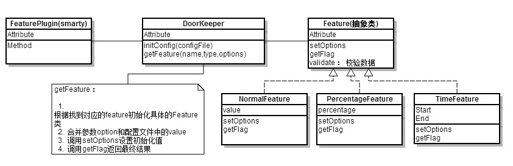

# 大纲

* 什么是feature-flags
* 背景分析
    * 目前的现状和问题
    * feature-flags的优点
* 用户使用设计
* 系统实现设计

## 什么是feature-flags

    Feature flag 是一个可以通过配置来控制是否打开页面某一功能，而不用重新发布代码的系统。可以做到同一份儿代码，针对不同的环境、条件决定是否展现某一功能。核心思想就是将功能的开发和代码的发布解耦。

##背景分析

目前大多数团队都采用FeatureBranch开发模式，每一个新功能或者bug修复都会单独一个分支开发，完成后会合并到主干。这个开发模式有以下几个缺点：

### FeatureBranch 缺点

* 需要合并分支。分支合并是一件很容易出错的事，特别是某一功能需要开发很长时间时。
* 当有多个Feature Branch时，只有当分支都合并到trunk后才能测试功能之间的交互。
* 针对Feature Branch的功能做A/B测试、小流量测试不是很方便。

### Feature-flag 优点

* 主干开发，不需要分支合并，可以持续集成，加快产品迭代速度。
* 更快速的响应bug修复以及小功能开发
* 可以通过配置文件很方便的实现A/B测试功能
* 新功能回滚也可以通过配置文件快速实现，不用重新发布上线

## 使用设计

### 框架 ： UI Flag设计

提供Smarty插件判断当前feature是否可用

#### 使用方法

    写法一 ：
    

    

    写法二 ：
    

    

    

* name ： feature的名称
* feature的作用域为模块级别

#### 其他方案讨论

**feature函数调用方案**

使用方法 ：

    {if feature(featureName)}
        //html featureA
    {/else}
        //html featureB
    {/if}

问题 ：

* 针对FE同学暴露UI会比插件更容易理解，Smarty本身也更倾向于采用插件扩展的方式，尽量减少页面的逻辑
* feature函数需要在渲染模版前注册，鉴于百度内部Smarty有RD负责，需要推动RD修改代码，调用FIS提供的类库和接口，推动比较麻烦。
* 基于上面原因采用插件会使得方案更加独立，可移植性更好

#### type分类 ：

* Switch ： 通过true/false控制feature是否生效；
* Ip : 通过ip范围控制是否生效； 例如：172.22.1.16-172.22.1.65；
* Percentage : 通过百分比控制；例如0.03，开发百分之三的用户；
* Date : 通过日期控制，规定日期之间时间feature为on，其他时间时间feature为off； 例如 2013-12-23 15:00:00 | 2013-12-23 15:00:00，feature测试两天
* roles : 用户角色(暂不实现)

#### type扩展

* 相对路径是指相对于config目录
* feature的优先级

### 框架 ： API Flags接口

* 提供方便，快捷的方法判断feature当前是否可用(为后续RD接入准备)
* DoorKeeper.getFeature("name") : 返回该feature是否可用

        if(DoorKeeper.getFeature("featureA")){
            // output featureA
        }else{
           //  output featureB
        }

### 配置文件

### 配置文件写法 ： 采用JSON格式

        {
            "deploy" : {
                "name" :
                "server" :
            },
            "features" : {
                "featureA" : {
                    "type" : "",
                    "name" : "",
                    "desc" : "",
                    "value" : "根据type不同而变化"
                },
                "featureB" : {

                }
            }
        }

### 管理

* 可以通过CMS单独上线配置文件
* UI Flag中的作为默认值，配置中的取值优先级高于UI Flag中的取值。

### FeatureService平台

**平台详细设计等框架雏形开发完成后在补充**

#### 平台入口

#### 功能

提供一个UI操作界面，集中管理模块中的所有feature，具有以下几点功能 ：

* 获取所有的feature
* 修改任意一个feature的取值
* Config的校验功能 ：  检验时间、IP等取值是否可以，Config是否有效
* Log功能 ： 记录所有feature的修改who、when
* 保存后能够迅速自动发布到线上生效
* 是否可以删除？(待考虑)
* 权限管理(优先级不高)

## 实现设计

### 框架

#### 插件的实现方案

**block+compiler实现方案**

block.feature.php

compiler.featureelse.php

**compiler插件实现方案**

### 平台

#### UI界面

#### FeatureController类

Controller类比较简单，这里大概描述需要实现哪些功能

* feature的删、改、查、校验等功能
* feature changelog功能
* config的发布功能(连接CMS)

